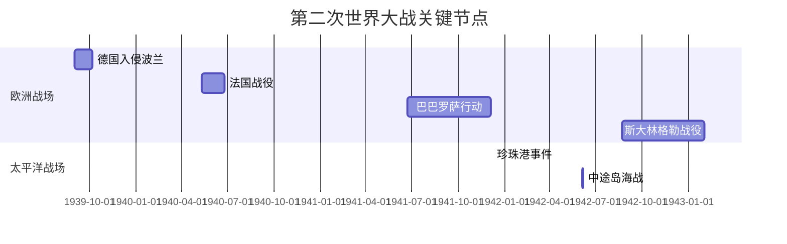
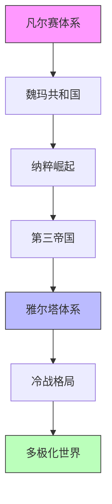

# 鲲鹏志 TODO

> **使用说明**：每完成一项，将 `[ ]` 改为 `[x]`。按优先级顺序执行。

---

## 📋 快速导航

- [P0 - 立即实施](#p0---立即实施)（核心基础）
- [P1 - 近期实施](#p1---近期实施)（内容增强）
- [P2 - 中期实施](#p2---中期实施)（交互体验）
- [P3 - 长期优化](#p3---长期优化)（高级功能）
- [分章节详细清单](#分章节详细清单)
- [技术规范速查](#技术规范速查)

---

## 一、Wiki.js 知识库链接

### 1.1 链接原则
- **概念解释** → 链接到 Wiki.js 的详细词条
- **人物/事件** → 链接到 Wiki.js 的人物传记或事件档案
- **技术术语** → 链接到 Wiki.js 的技术文档

### 1.2 链接格式
```markdown
[概念名称](https://wiki.kunpengzhi.fun/s/词条路径)
```

### 1.3 应用场景示例

#### 双约记（地缘政治）
- "雅尔塔体系" → 链接到 Wiki.js 的雅尔塔会议详解
- "马歇尔计划" → 链接到经济援助计划的技术分析
- "北约东扩" → 链接到地缘战略演变时间线

#### 牧人记（历史篇）
- "传国玉玺" → 链接到文物考古详情
- "三星堆文明" → 链接到考古发现与争议
- "墨子思想" → 链接到哲学体系解析

#### 牧兰记（地质篇）
- "白令陆桥" → 链接到地质变迁模拟
- "象雄文明" → 链接到考古证据链
- "M117单倍体" → 链接到基因图谱分析

#### 牧月记（技术篇）
- "黑洞信息悖论" → 链接到物理学推导过程
- "量子纠缠" → 链接到实验验证记录
- "引力波探测" → 链接到LIGO技术文档

---

## 二、代码动画与可视化

### 2.1 Mermaid 图表

#### 适用场景
- **流程图**：历史事件因果链、决策树
- **时序图**：国际关系演变、技术迭代
- **架构图**：系统结构、组织架构
- **甘特图**：项目时间线、战争进程

#### 示例：二战时间线


#### 示例：权力结构演化


### 2.2 Asciinema 终端录制

#### 适用场景
- **命令行操作演示**：Git 工作流、数据处理
- **交互式教程**：代码执行过程
- **系统监控**：实时数据展示

#### 使用方法
1. 录制终端会话：`asciinema rec demo.cast`
2. 上传到 asciinema.org
3. 在 Markdown 中嵌入：

```markdown
<script id="asciicast-xxxxx" src="https://asciinema.org/a/xxxxx.js" async></script>
```

或使用 Hugo shortcode：
```markdown

```

### 2.3 视频嵌入

#### 适用场景
- **历史影像**：战争纪录片、新闻片段
- **科学可视化**：天体运行、地质运动
- **演讲录音**：重要人物讲话

#### 使用方法
使用自定义 shortcode：

```markdown

```

或在 layouts/shortcodes/video.html 中定义：
```html
<video controls poster="{{ .Get "poster" }}">
  <source src="{{ .Get "src" }}" type="video/mp4">
</video>
```

---

## 三、外部资源链接

### 3.1 学术引用

#### 格式规范
```markdown
[^1]: 作者，《书名》，出版社，年份，页码。
[^2]: [论文标题](DOI链接)，期刊名，卷号(期号)，年份。
```

#### 示例
```markdown
根据克劳塞维茨的理论[^1]，战争是政治的延续。

[^1]: 克劳塞维茨，《战争论》，商务印书馆，1978年，第23页。
```

### 3.2 数据源链接

#### 适用场景
- **统计数据**：GDP、人口、军事力量对比
- **原始档案**：解密文件、条约文本
- **地图资源**：历史疆域变化

#### 推荐数据源
- **世界银行数据**：https://data.worldbank.org/
- **联合国统计**：https://unstats.un.org/
- **CIA World Factbook**：https://www.cia.gov/the-world-factbook/
- **中国国家统计局**：http://www.stats.gov.cn/

### 3.3 交互式地图

#### 适用场景
- **领土变迁**：动态展示疆域变化
- **行军路线**：战争进程可视化
- **贸易路线**：丝绸之路、海上航线

#### 实现方式
使用 Leaflet.js 或 Mapbox：

```html
<div id="map" style="height: 400px;"></div>
<script>
  var map = L.map('map').setView([51.505, -0.09], 13);
  L.tileLayer('https://{s}.tile.openstreetmap.org/{z}/{x}/{y}.png').addTo(map);
</script>
```

---

## 分章节详细清单

### 双约记（地缘政治）

| 章节 | Wiki.js 链接 | Mermaid 图表 | 多媒体资源 | 状态 |
|------|-------------|-------------|-----------|------|
| 第一章 1936-1941 | [ ] 纳粹美学<br>[ ] 奥运会宣传<br>[ ] 马奇诺防线 | [ ] 纳粹崛起流程 | [ ] 1936奥运影片 | ⏳ |
| 第二章 1941-1945 | [ ] 巴巴罗萨<br>[ ] 斯大林格勒<br>[ ] 诺曼底登陆 | [ ] 二战时间线 | [ ] 战争纪录片 | ⏳ |
| 第三章 1945-1949 | [ ] 雅尔塔体系<br>[ ] 铁幕演说<br>[ ] 联合国成立 | [ ] 冷战格局演化 | [ ] 丘吉尔演讲音频 | ⏳ |
| 第四章 1949-1956 | [ ] 朝鲜战争<br>[ ] 核武器发展<br>[ ] 万隆会议 | [ ] 核扩散时间线 | [ ] 原子弹爆炸影像 | ⏳ |
| 第五章 1956-1966 | [ ] 古巴导弹危机<br>[ ] 越战升级<br>[ ] 中苏分裂 | [ ] 危机决策树 | [ ] 肯尼迪讲话 | ⏳ |
| 第六章 1966-1980 | [ ] 中美建交<br>[ ] 石油危机<br>[ ] 布雷顿森林解体 | [ ] 谈判流程图 | [ ] 尼克松访华视频 | ⏳ |
| 第七章 1980-2001 | [ ] 苏联解体<br>[ ] 欧盟扩张<br>[ ] 东欧剧变 | [ ] 解体时间线 | [ ] 柏林墙倒塌 | ⏳ |
| 第八章 2001-2009 | [ ] 反恐战争<br>[ ] 金融危机<br>[ ] 颜色革命 | [ ] 危机传导机制 | [ ] 9/11影像资料 | ⏳ |
| 第九章 2009-2022 | [ ] 一带一路<br>[ ] 疫情全球传播<br>[ ] 贸易战 | [ ] 路线图 | [ ] 疫情数据可视化 | ⏳ |

### 牧人记（历史篇）

| 章节 | Wiki.js 链接 | Mermaid 图表 | 多媒体资源 | 状态 |
|------|-------------|-------------|-----------|------|
| 第01章 玉玺 | [ ] 传国玉玺<br>[ ] 蓝田玉<br>[ ] 正统认同 | [ ] 传承谱系 | [ ] 3D模型 | ⏳ |
| 第02章 三星堆 | [ ] 青铜神树<br>[ ] 祭祀坑<br>[ ] 古蜀文明 | [ ] 考古时间线 | [ ] 发掘过程视频 | ⏳ |
| 第03章 墨子 | [ ] 兼爱非攻<br>[ ] 机关术<br>[ ] 光学原理 | [ ] 逻辑推演图 | [ ] 机关复原动画 | ⏳ |
| 第04章 交易成本 | [ ] 货币演化<br>[ ] 市场制度<br>[ ] 信用体系 | [ ] 交易流程 | [ ] 古代市场模拟 | ⏳ |
| 第05章 农业vs商业 | [ ] 重农抑商<br>[ ] 盐铁论<br>[ ] 丝绸之路 | [ ] 商路网络 | [ ] 丝路地图 | ⏳ |
| 第06章 孔子 | [ ] 儒家思想<br>[ ] 六艺<br>[ ] 弟子谱系 | [ ] 传播路线 | [ ] 孔庙全景 | ⏳ |
| 第07章 木兰 | [ ] 北魏军制<br>[ ] 府兵制<br>[ ] 女性从军 | [ ] 军事架构 | [ ] 北魏文物 | ⏳ |
| 第08章 半江瑟瑟 | [ ] 南北朝对峙<br>[ ] 文化融合<br>[ ] 佛教东传 | [ ] 融合进程 | [ ] 石窟艺术 | ⏳ |
| 第09章 相似三角形 | [ ] 勾股定理<br>[ ] 《周髀算经》<br>[ ] 几何证明 | [ ] 证明流程 | [ ] 交互式几何 | ⏳ |

### 牧兰记（地质篇）

| 章节 | Wiki.js 链接 | Mermaid 图表 | 多媒体资源 | 状态 |
|------|-------------|-------------|-----------|------|
| 第01章 亚特兰蒂斯 | [ ] 古海岸线<br>[ ] 海平面变化<br>[ ] 沉没理论 | [ ] 沉没时间线 | [ ] 3D重建动画 | ⏳ |
| 第02章 深渊凝视 | [ ] 深海探测<br>[ ] 海底地形<br>[ ] 热液喷口 | [ ] 探测历程 | [ ] 深海视频 | ⏳ |
| 第03章 鲲鹏迁徙 | [ ] 兴凯湖<br>[ ] 青海湖<br>[ ] 古气候 | [ ] 迁徙路径 | [ ] 气候数据图 | ⏳ |
| 第04章 海市蜃楼 | [ ] 光学折射<br>[ ] 历史记录<br>[ ] 大气现象 | [ ] 原理示意 | [ ] 物理模拟 | ⏳ |
| 第05章 狐狼东渡 | [ ] 白令陆桥<br>[ ] 物种迁移<br>[ ] 冰期理论 | [ ] 迁移演化树 | [ ] 地质动画 | ⏳ |
| 第12章 彖的远征 | [ ] 东亚文明<br>[ ] 语言演化<br>[ ] 文化传播 | [ ] 传播链 | [ ] 语言分布图 | ⏳ |
| 第14章 象雄文明 | [ ] 雍仲符号<br>[ ] 九宫左旋<br>[ ] 苯教 | [ ] 符号演变 | [ ] 符号动画 | ⏳ |
| 第15章 M117 | [ ] 单倍体<br>[ ] 基因图谱<br>[ ] 族群迁徙 | [ ] 基因扩散 | [ ] 热力图 | ⏳ |
| 第18-22章 天文 | [ ] 28宿<br>[ ] 七曜<br>[ ] 历法系统 | [ ] 计算流程 | [ ] 星图动画 | ⏳ |

### 牧月记（技术篇）

| 章节 | Wiki.js 链接 | Mermaid 图表 | 多媒体资源 | 状态 |
|------|-------------|-------------|-----------|------|
| 第01章 完美假象 | [ ] 犯罪心理学<br>[ ] 证据链<br>[ ] 现场重建 | [ ] 证据分析 | [ ] 3D重建 | ⏳ |
| 第02章 引力雪橇 | [ ] 引力弹弓<br>[ ] 轨道力学<br>[ ] 深空探测 | [ ] 效应示意 | [ ] 轨道模拟 | ⏳ |
| 第03章 血祭 | [ ] 火星探测<br>[ ] 水星地貌<br>[ ] 太空竞赛 | [ ] 探测器轨迹 | [ ] 对比图像 | ⏳ |
| 第04章 黑洞悖论 | [ ] 事件视界<br>[ ] 信息守恒<br>[ ] 霍金辐射 | [ ] 信息流动 | [ ] 科学可视化 | ⏳ |
| 第05章 圆周率审计 | [ ] π计算史<br>[ ] 宇宙几何<br>[ ] 数学常数 | [ ] 计算时间线 | [ ] 交互计算器 | ⏳ |
| 第06章 无尽螺旋 | [ ] 星系演化<br>[ ] 暗物质<br>[ ] 宇宙膨胀 | [ ] 演化流程 | [ ] 3D可视化 | ⏳ |
| 第07章 量子计算 | [ ] 量子比特<br>[ ] 纠缠态<br>[ ] 量子算法 | [ ] 状态转换 | [ ] 量子模拟器 | ⏳ |

---

## P0 - 立即实施（核心基础）

### ✅ 已完成
- [x] Book 主题配置完成
- [x] 所有章节标题结构修复（H1/H2/H3）
- [x] 内部链接规范化（已添加 .md 扩展名）
- [x] 自动化链接检查脚本（`make check-links`）

### 🔄 进行中
- [ ] **Wiki.js 核心概念链接**（每章至少 3-5 个）
  - [ ] 双约记：雅尔塔体系、马歇尔计划、北约东扩
  - [ ] 牧人记：传国玉玺、三星堆文明、墨子思想
  - [ ] 牧兰记：白令陆桥、象雄文明、M117单倍体
  - [ ] 牧月记：黑洞信息悖论、量子纠缠、引力波探测

---

## P1 - 近期实施（内容增强）

### Mermaid 图表（每章至少 1 个）
- [ ] **双约记**
  - [ ] 第一章：纳粹崛起流程图
  - [ ] 第二章：二战时间线（gantt）
  - [ ] 第三章：雅尔塔会议决策树
  - [ ] 第四章：冷战格局演化图
  - [ ] 第五章：古巴导弹危机时序图
  - [ ] 第六章：中美建交谈判流程
  - [ ] 第七章：苏联解体时间线
  - [ ] 第八章：金融危机传导机制
  - [ ] 第九章：一带一路路线图

- [ ] **牧人记**
  - [ ] 第01章：传国玉玺传承谱系
  - [ ] 第02章：三星堆考古发现时间线
  - [ ] 第03章：墨家逻辑推演图
  - [ ] 第04章：古代市场交易流程
  - [ ] 第05章：商路网络图
  - [ ] 第06章：儒家思想传播路线
  - [ ] 第07章：北魏军事制度架构
  - [ ] 第08章：南北朝文化融合进程
  - [ ] 第09章：几何证明流程图

- [ ] **牧兰记**
  - [ ] 第01章：亚特兰蒂斯沉没时间线
  - [ ] 第03章：鲲鹏迁徙路径图
  - [ ] 第05章：物种迁移演化树
  - [ ] 第12章：东亚文明传播链
  - [ ] 第14章：雍仲符号演变图
  - [ ] 第15章：基因扩散热力图
  - [ ] 第18-22章：天文历法计算流程

- [ ] **牧月记**
  - [ ] 第01章：犯罪现场证据链分析
  - [ ] 第02章：引力弹弓效应示意
  - [ ] 第03章：火星探测器轨迹
  - [ ] 第04章：黑洞信息流动画
  - [ ] 第05章：π计算历史时间线
  - [ ] 第06章：星系演化流程
  - [ ] 第07章：量子比特状态转换

### 数据可视化
- [ ] 关键统计数据图表（GDP、人口、军事力量）
- [ ] 历史事件时间线（交互式）
- [ ] 重要人物关系图谱

### 多媒体嵌入
- [ ] 历史影像视频（每系列至少 2-3 个）
- [ ] 科学可视化动画（地质、天体）
- [ ] 重要演讲音频片段

---

## P2 - 中期实施（交互体验）

### 交互式地图
- [ ] **领土变迁地图**
  - [ ] 双约记：欧洲疆域变化（1936-2022）
  - [ ] 牧人记：华夏历代版图
  - [ ] 牧兰记：古海岸线重建

- [ ] **行军/迁徙路线图**
  - [ ] 二战主要战役路线
  - [ ] 丝绸之路贸易路线
  - [ ] 族群迁徙路径（M117等）

- [ ] **资源分布图**
  - [ ] 石油、天然气分布
  - [ ] 矿产资源分布
  - [ ] 农业产区分布

### Asciinema 终端演示
- [ ] Git 工作流演示
- [ ] 数据处理命令行操作
- [ ] 系统监控实时展示

### 3D 模型嵌入
- [ ] 传国玉玺 3D 模型
- [ ] 三星堆青铜器 3D 展示
- [ ] 天体运行 3D 模拟

---

## P3 - 长期优化（高级功能）

### 自定义动画
- [ ] 物理引擎模拟（引力、轨道计算）
- [ ] 地质演变动画（板块运动、海陆变迁）
- [ ] 化学反应/生物演化动画

### 交互式学习模块
- [ ] 量子计算器（在线模拟器）
- [ ] 历法转换器（农历/公历/干支）
- [ ] 星图浏览器（28宿、星座）

### AR/VR 内容
- [ ] 虚拟博物馆（文物3D漫游）
- [ ] 遗址AR复原（三星堆、殷墟）
- [ ] VR战场重现（斯大林格勒、诺曼底）

---

## 技术规范速查

### Markdown 最佳实践

```markdown
# H1 章节标题（自动生成，无需手动添加）

## H2 小节标题

正文内容...

### H3 子标题

- 列表项
- 支持 **粗体** 和 *斜体*

> 引用块用于强调重要观点

```python
# 代码块
def example():
    return "Hello"
```

[外链文本](URL "悬停提示")



graph TD
    A --> B

```

### Frontmatter 规范

```yaml
---
title: "章节标题"
description: "简短描述"
book: "系列名称"
weight: 1  # 排序权重
is_published: true
date: "2026-05-07T12:00:00.000Z"
tags: ['标签1', '标签2']
editor: markdown
---
```

### 文件命名规范
- 章节文件：`第XX章 标题.md`
- 目录文件：`目录.md`
- 图片资源：`/static/images/章节/描述.jpg`
- 视频资源：`/static/videos/章节/描述.mp4`

---

## 质量检查清单

在发布每个章节前，确认：

- [ ] 至少有 3 个 Wiki.js 外链
- [ ] 至少有 1 个 Mermaid 图表或数据可视化
- [ ] 所有内部链接有效（运行 `make check-links`）
- [ ] 标题层级正确（H1 → H2 → H3）
- [ ] 图片有 alt 文本
- [ ] 视频有 poster 封面
- [ ] 代码块有语法高亮
- [ ] 引用有脚注标注
- [ ] Frontmatter 完整（title, weight, tags）

---

## 快速参考

### 常用 Shortcodes

```markdown
...




```

### 常用 Mermaid 类型

- `graph` - 流程图
- `sequenceDiagram` - 时序图
- `gantt` - 甘特图
- `pie` - 饼图
- `classDiagram` - 类图
- `stateDiagram` - 状态图
- `erDiagram` - 实体关系图

### Wiki.js 链接模板

```
https://wiki.kunpengzhi.fun/s/双约记/雅尔塔体系
https://wiki.kunpengzhi.fun/s/牧人记/传国玉玺
https://wiki.kunpengzhi.fun/s/牧兰记/白令陆桥
https://wiki.kunpengzhi.fun/s/牧月记/黑洞信息悖论
```

---

**最后更新**: 2026-05-11  
**维护者**: Agentic Network  
**版本**: 2.0 (TODO 清单版)
