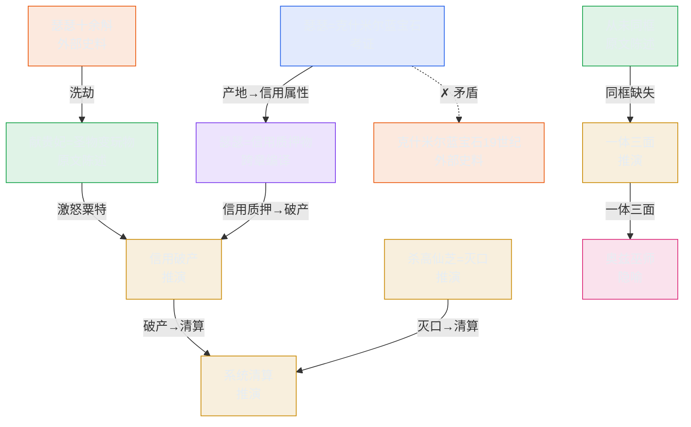

# 原子图谱 + Citation 演示

> 第08章《半江瑟瑟半江红》罗格斯化试点：论述挂 citation（角标），图谱见下。

## 一、论述中的 Citation

安史之乱刚开打，玄宗第一个杀的是最能打的高仙芝。这不是猜忌，是灭口：戴罪立功才是军事最优解，战时斩主将违背一切军事逻辑 。

高仙芝被杀的真正原因，藏在七年前的石国大劫案：他洗劫石国国库，获瑟瑟十余斛 。瑟瑟不是普通宝石，是克什米尔产的蓝宝石 ，是粟特商业共同体的信用质押物 ——他把粟特人的圣物献给了杨贵妃 ，圣物变玩物，信用破产，安禄山七年后来"讨债"。

更惊人的是：安禄山和史思明，在《旧唐书》里从未同时出现在同一场景 。奥卡姆剃刀一挥：四个人，其实是一个系统 ——就像奥兹巫师，四具傀儡一个牵丝人 。

## 二、原子图谱（Mermaid）

## 三、Citation 样式说明

- 角标颜色 = 原子类型：绿=原文陈述 · 黄=推演 · 蓝=考证 · 橙=外部史料 · 紫=跨章编译 · 红=隐喻
- 悬停角标 → 显示原子主张
